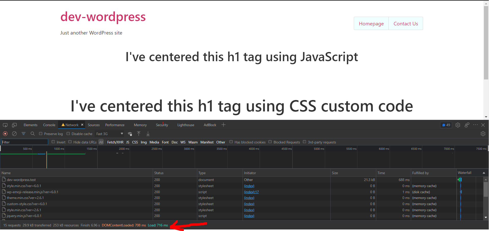
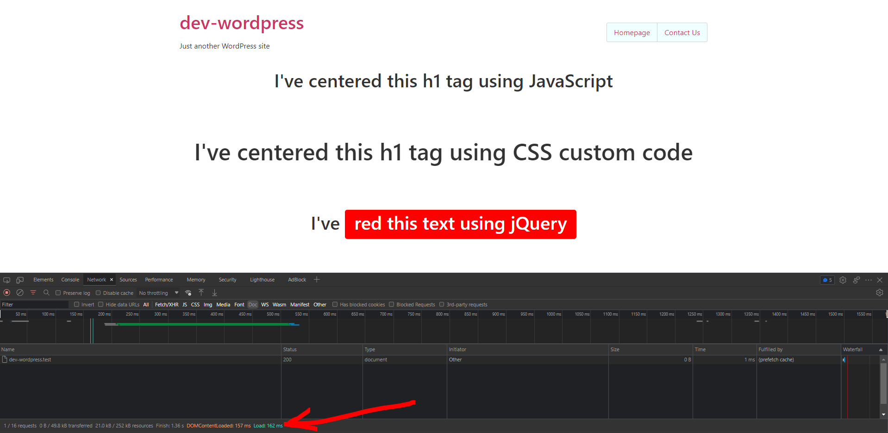

=== SM - Prefetch ===
 
Contributors: sulaimanmisri
Tags: Prefetch, Speed Optimization, Sulaiman Misri
Requires at least: 5.5
Tested up to: 6.0.1
Stable tag: 1.1
License: GPLv2 or later
License URI: http://www.gnu.org/licenses/gpl-2.0.html
  
This plugin will make your website load faster using Prefetch Algorithm from Quicklink. Best if you have multipage website.
  
== Installation ==
  
1. Upload the plugin folder to your /wp-content/plugins/ folder.
1. Go to the **Plugins** page and activate the plugin.
  
== Frequently Asked Questions ==
  
= How do I use this plugin? =
  
1. Simply install the plugin and then the plugin will make a prefetch automatic to all your pages
  
= How to uninstall the plugin? =
  
1.Simply deactivate and delete the plugin. 
  
== Screenshots ==
1. Speed simulation 1 (before install sm-prefetch)

2. Speed simulation 2 (after install sm-prefetch)

  
== Changelog ==

= 1.1 =
* Fix plugin serve all the files locally.

= 1.0 =
* Plugin released. 